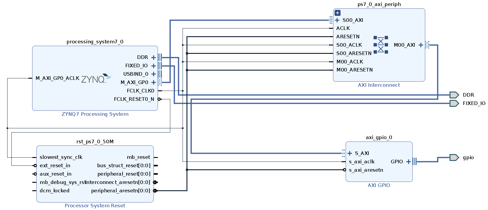

# GPIO on PYNQ Z2 board
In this repo we provide a design to implement General Purpose I/O (GPIO) on a Z2 with PYNQ 2.6 build. The design was created with Vivado 2020.2.

Here we find the xsa package, which contains bitstream and hwh files in order to be used in the provided jupyter notebook.

We expose GPIO through analog pins, specifically A0 analog pin.

Constraints are built as follow:
```
set_property -dict {PACKAGE_PIN Y11 IOSTANDARD LVCMOS33} [get_ports gpio_tri_o]
```

The block design is shown in the following image

