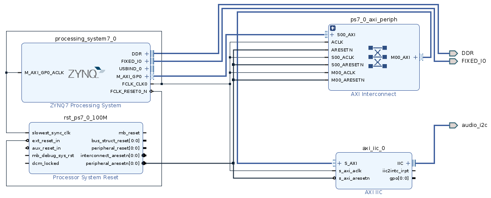

# I2C on PYNQ Z2 board
In this repo we provide a design to implement Inter-Integrated Circuit (I2C) on a Z2 with PYNQ 2.6 build. The design was created with Vivado 2020.2.

Here we find the xsa package, which contains bitstream and hwh files in order to be used in the provided jupyter notebook.

We expose I2C through PMODB, using the first 2 pinout (W14, Y14), where:
 - W14 (PIN 1) → SCL
 - Y14 (PIN 2) → SDA

In order to use I2C on PMODB pins, we had to specify a PULLUP resistor on every output port.

Constraints are built as follow:
```
set_property -dict {PACKAGE_PIN W14 IOSTANDARD LVCMOS33} [get_ports audio_i2c_scl_io]
set_property -dict {PACKAGE_PIN Y14 IOSTANDARD LVCMOS33} [get_ports audio_i2c_sda_io]

set_property PULLUP true [get_ports audio_i2c_scl_io]
set_property PULLUP true [get_ports audio_i2c_sda_io]
```

The block design is shown in the following image


