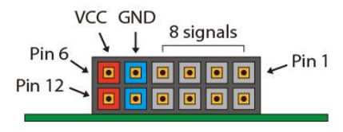

# Communication protocols in PL on PYNQ Z2

In this repo we provide some tutorials to build in PL on PYNQ Z2 board some communication protocols. Specifically we have built 4 protocols:
 - General Purpose I/O (GPIO);
 - Inter-Integrated Circuit (I2C);
 - Serial Peripheral Interface (SPI);
 - Universal Asynchronous Receiver-Transmitter (UART);

## Port usage and definition

For 3 (I2C, SPI and UART) of all communication protocols we have used PMOD B module, which is not shared with other elements of the board (in our specific board PMOD A module is shared with Raspberry Pi header). The pinout definition is shown in the following image:

As we can see in the previuos image, the first pin is in the high right corner of the module, the last one is in the left low corner.

For GPIO communication protocol we have used an analog port, specifically A0.

## Authors
[Staff MakarenaLabs](mailto:staff@makarenalabs.com)