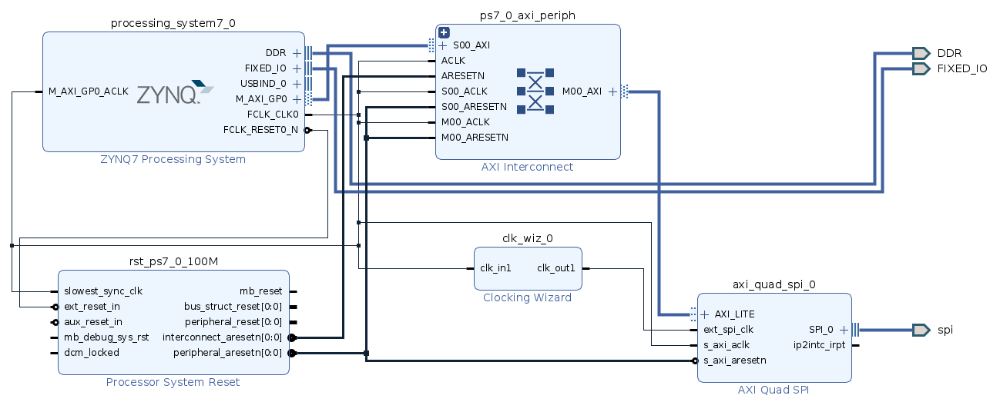

# SPI on PYNQ Z2 board
In this repo we provide a design to implement Serial Peripheral Interface (SPI) on a Z2 with PYNQ 2.6 build. The design was created with Vivado 2020.2.

Here we find the xsa package, which contains bitstream and hwh files in order to be used in the provided jupyter notebook.

We expose SPI through PMODB, using the first 4 pinout (W14, Y14, T11, T10), where:
 - W14 (PIN 1) → MISO
 - Y14 (PIN 2) → MOSI
 - T11 (PIN 3) → SCLK
 - T10 (PIN 4) → SS

Constraints are built as follow:
```
set_property -dict {PACKAGE_PIN W14 IOSTANDARD LVCMOS33} [get_ports spi_io1_io]
set_property -dict {PACKAGE_PIN Y14 IOSTANDARD LVCMOS33} [get_ports spi_io0_io]
set_property -dict {PACKAGE_PIN T11 IOSTANDARD LVCMOS33} [get_ports spi_sck_io]
set_property -dict {PACKAGE_PIN T10 IOSTANDARD LVCMOS33} [get_ports spi_ss_io]
```

The block design is shown in the following image

