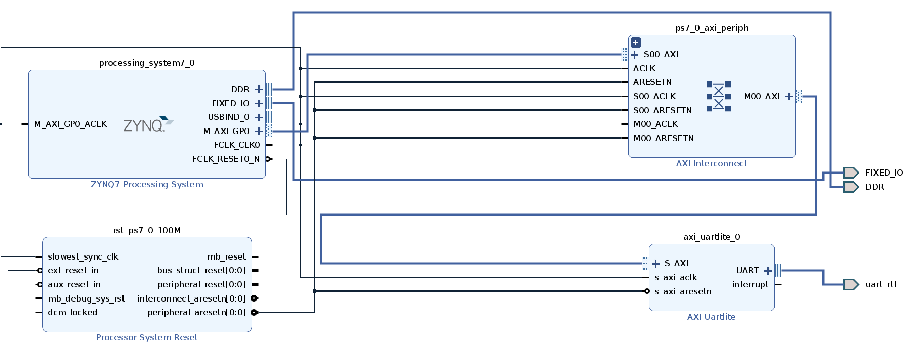

# UART on PYNQ Z2 board
In this repo we provide a design to implement Universal Asynchronous Receiver-Transmitter (UART) on a Z2 with PYNQ 2.6 build. The design was created with Vivado 2020.2.

Here we find the xsa package, which contains bitstream and hwh files in order to be used in the provided jupyter notebook.

We expose UART through PMODB, using the first 2 pinout (W14, Y14), where:
 - W14 (PIN 1) → RX
 - Y14 (PIN 2) → TX

Constraints are built as follow:
```
set_property -dict {PACKAGE_PIN W14 IOSTANDARD LVCMOS33} [get_ports uart_rtl_rxd]
set_property -dict {PACKAGE_PIN Y14 IOSTANDARD LVCMOS33} [get_ports uart_rtl_txd]
```

The block design is shown in the following image

